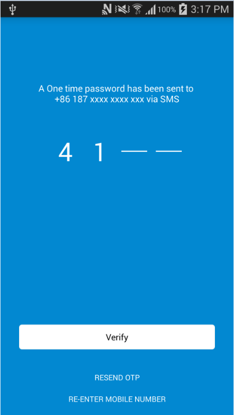

## VerifyCodeView
An Android custom view which is used for inputting OTP code.

###Simple Use



###Demo


## Usage

1. Include the library as local library project.

    `compile 'com.github.irvingryan:verifycodeview:1.1.0'`

2. in your layout.xml

    **Default**
    ```
        <com.github.irvingryan.VerifyCodeView
             android:layout_width="wrap_content"
             android:layout_height="wrap_content"/>
    ```
    **Custom**

    ######Attributes

    | custom attributes | format    | more                    |
    | :---------------- | :-------- | :---------------------- |
    | vcTextColor       | color     | your text color         |
    | vcTextSize        | integer   | code's lenght           |
    | vcFont            | string    | font path in assets     |
    | vcLineWidth       | dimension | background line's width |
    | vcLineStyle       | enum      | show/hide lines         |

    ######xml code
    ```
     <!--your text color-->
     app:vcTextColor="[your color]"
     <!--code's lenght-->`
     app:vcTextSize="6"
     <!--font file in assets-->
     app:vcFont="[font name]"
     <!--background line's width-->
     app:vcLineWidth="4px"
     <!--background line's style-->
     app:vcLineStyle="underText"
    ```

3. in your activity
    ```
    //text change listener
    verifyCodeView.setListener(new VerifyCodeView.OnTextChangListener() {
                @Override
                public void afterTextChanged(String text) {
                    Toast.makeText(VerifyOtpActivity.this,text,Toast.LENGTH_SHORT).show();
                }
            });
    ```

##Licence
 Copyright 2016 IrvingRyan

 Licensed under the Apache License, Version 2.0 (the "License"); you may not use this file except in compliance with the License. You may obtain a copy of the License at

 http://www.apache.org/licenses/LICENSE-2.0

 Unless required by applicable law or agreed to in writing, software distributed under the License is distributed on an "AS IS" BASIS, WITHOUT WARRANTIES OR CONDITIONS OF ANY KIND, either express or implied. See the License for the specific language governing permissions and limitations under the License.
